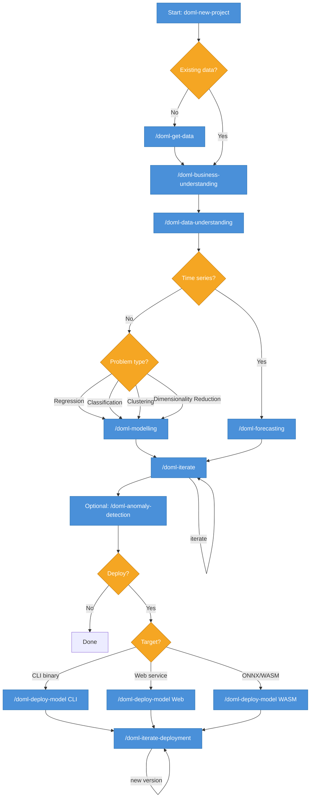

# DoML — Do Machine Learning

A meta-prompting framework that guides AI coding assistants through reproducible, end-to-end ML analysis, from raw data to deployed model.

---

## What is DoML?

DoML is a collection of skills and workflow templates that guide data scientists through the full ML lifecycle: business framing, exploratory data analysis, modelling, optional forecasting, and deployment. Each phase produces reproducible Jupyter notebooks and stakeholder-ready HTML reports, so the full decision trail is always visible.

All notebook code runs inside a Docker container — no local Python environment to configure, no dependency conflicts, and no "works on my machine" surprises. The same container runs on any OS, making analyses fully portable and trivially reproducible by anyone with Docker installed.

It enforces reproducibility rules automatically: random seeds at the top of every notebook, all paths resolved via a `PROJECT_ROOT` environment variable, `data/raw/` mounted read-only so source data is never overwritten, and a fully pinned `requirements.txt` generated from `requirements.in` via `pip-compile`.

Every command is context-aware: it reads `config.json` (problem type, language preference, time factor) so you never answer the same question twice. Start with `/doml-new-project`, answer a short interview, and every subsequent command knows your dataset and goals.

Each modelling phase produces a leaderboard ranking models by their evaluation metric, so the best-performing configurations are always visible across runs. Use `/doml-iterate` to try new hyperparameters, feature sets, or algorithms — results are appended to the leaderboard and the top model is always available for deployment.

---

## Requirements

- **Docker Desktop** (macOS / Windows) or **Docker Engine** (Linux)
- **Claude Code CLI** — `npm install -g @anthropic-ai/claude-code`
  _or_ GitHub Copilot with agent mode enabled in VS Code

---

## Quick Start

**macOS / Linux**
```bash
bash <(curl -fsSL https://raw.githubusercontent.com/wpalace/doML/main/install.sh)
```

**Windows (PowerShell)**
```powershell
irm https://raw.githubusercontent.com/wpalace/doML/main/install.ps1 | iex
```

After install, open the project folder in Claude Code and run:

```
/doml-new-project
```

---

## How It Works



---

## Commands

| Command | Description | Key flags |
|---|---|---|
| `/doml-new-project` | Guided kickoff: interview → Docker environment + scaffold → planning artifacts | — |
| `/doml-business-understanding` | Business Understanding phase: generates notebook + stakeholder HTML report | `--guidance` |
| `/doml-data-understanding` | EDA phase: DuckDB profiling, statistical tests, tidy validation + HTML report | `--guidance` |
| `/doml-modelling` | Modelling phase for any problem type (regression, classification, clustering, dim-reduction) | `--guidance` |
| `/doml-iterate` | New modelling iteration; reads `problem_type` from `config.json` and routes automatically | — |
| `/doml-anomaly-detection` | Optional anomaly detection after EDA; generates notebook + HTML report | `--file`, `--guidance` |
| `/doml-forecasting` | Time series forecasting phase (runs when `time_factor=true` in `config.json`) | — |
| `/doml-get-data` | Download datasets from Kaggle or direct URLs into `data/raw/` | — |
| `/doml-deploy-model` | Deploy top leaderboard model to a chosen target | `--target cli\|web\|wasm` |
| `/doml-deploy-cli` | Build a self-contained Linux CLI binary from a deployed model | — |
| `/doml-deploy-web` | Deploy model as a FastAPI web service | — |
| `/doml-deploy-wasm` | Deploy model as a self-contained ONNX/WebAssembly bundle | — |
| `/doml-iterate-deployment` | Iterate an existing deployment to a new version | `--version` |
| `/doml-progress` | Show current project status, completed phases, and next recommended action | — |

---

## Reproducibility

DoML enforces four reproducibility rules automatically:

- **Random seeds** — `SEED = 42` is set at the top of every generated notebook before any sampling, splitting, or model fitting
- **Relative paths** — all file references resolve from the `PROJECT_ROOT` environment variable; no hardcoded absolute paths
- **Immutable raw data** — `data/raw/` is mounted read-only in Docker; source files are never modified or overwritten
- **Pinned dependencies** — `requirements.txt` pins every package with `==`; edit `requirements.in` and regenerate with `pip-compile`

See [`CLAUDE.md`](CLAUDE.md) for the full set of conventions Claude Code follows in every DoML analysis project.

---

## Support the Project

Building DoML consumed a meaningful amount of AI compute — and yes, the top-tier Claude Max plan was purchased specifically to build this. If it saves you time, a small donation is appreciated.

- PayPal: [paypal.me/WilliamPalace442](https://paypal.me/WilliamPalace442)
- Venmo: [@William-Palace](https://venmo.com/William-Palace)

## Future Milestones Planned
This project is very green and quite rough around the edges, so don't expect perfection. Here are some future plans I would like to work on as time permits:

- Make the container more efficient - it is bulky and slow to build on a cold cache
- Add more skills to improve the cababilities of different problem types (particularly time sereis)
- Add a high throughput, qualitative QA qutomation process scored by LLM judges - run the framework against a matrix of datasets using various LLMs with OpenClaw orchestrating the process
- Extend framewowrk with deep learning capabilities

